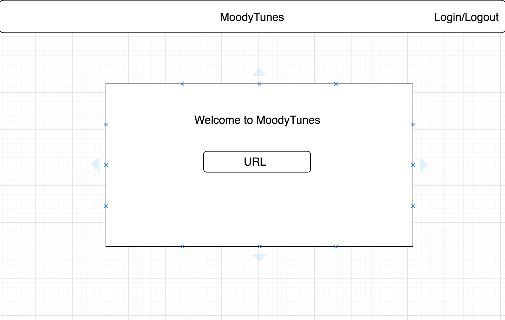
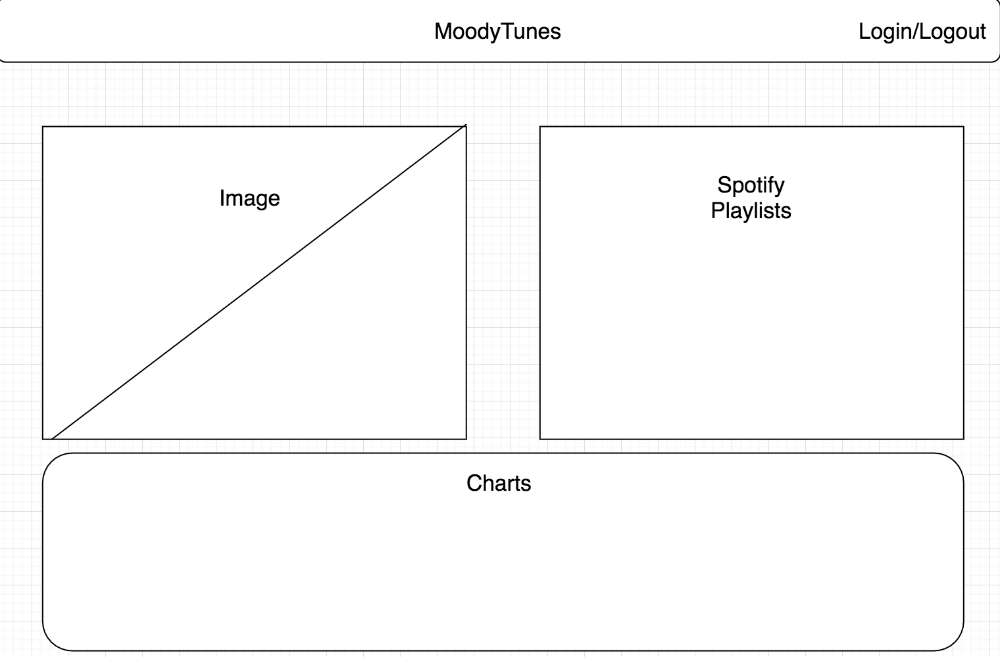

# MoodyTunes #

Users can upload a portrait of themselves or a photo that they find on the internet that expresses their current emotions. Using the Azure Face API, users will receieve a list of the emotions that are most likely being expressed by the person in the photo.

#### User Stories ####
* Benito is down in the dumps and needs something to cheer him up. By uploading a portrait that expresses his emotions, he can find a variety of music catered to his needs.
* Draco has listened to all of his songs way too many times and needs some new music to listen to.

#### Planning ####

#### Routes ####

Method | URL | Purpose
------ | --- | -------
GET | / | home/landing page
GET | /favorites | saved playlists
GET | /moods | saved moods (images w/ charts)
GET | /search | the main page where users input urls
GET | /results | results from api rendered w/ charts and playlists
POST | /results | api request
GET | /login | logging in
GET | /logout | logging out

#### Tech Used ####
* Ruby on Rails
* Microsoft Azure Faces API
* Bootstrap
* Material Design
* ChartJS

#### Credits ####
* 

#### Next Steps ####
* Add option for users to upload images instead of just the URL